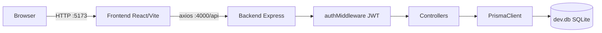

# AGENTS.md
This file provides guidance to Verdent when working with code in this repository.

## Table of Contents
1. Commonly Used Commands
2. High-Level Architecture & Structure
3. Key Rules & Constraints
4. Development Hints

## Commands
- **Start full system:** `python main.py` (from project root — starts backend + frontend)
- **Backend only:** `cd backend && npm run dev` (nodemon, auto-reload)
- **Frontend only:** `cd frontend && npm run dev` (Vite dev server)
- **Create/sync DB:** `cd backend && npx prisma db push`
- **Regenerate Prisma Client:** `cd backend && npx prisma generate`
- **Install backend deps:** `cd backend && npm install`
- **Install frontend deps:** `cd frontend && npm install`

## Architecture
- **`main.py`** — Python launcher that kills existing node processes, checks Node/npm availability, then spawns backend and frontend as child processes
- **`backend/`** — Node.js + Express (ES modules, `"type": "module"`), runs on port `4000`
  - `src/index.js` — entry point, registers routes, starts HTTP server
  - `src/routes/` — authRoutes, interactionRoutes, systemRoutes
  - `src/controllers/` — authController, interactionController, systemController
  - `src/middlewares/authMiddleware.js` — JWT Bearer token validation
  - `src/services/prismaClient.js` — singleton PrismaClient
  - `prisma/schema.prisma` — SQLite DB with `User` and `Interaction` models
  - `.env` — requires `DATABASE_URL` (SQLite file path) and `JWT_SECRET`
- **`frontend/`** — React 18 + Vite + React Router v6, runs on port `5173`
  - `src/main.jsx` — renders `<App>` wrapped in `<BrowserRouter>`
  - `src/App.jsx` — routing (`/` = AuthPanel, `/dashboard` = ProtectedRoute)
  - `src/services/api.js` — axios instance pointing to `http://localhost:4000/api`, injects Bearer token from localStorage automatically
  - `src/services/authService.js` — signup, login, getProfile, logAction, history
  - `src/services/systemService.js` — getSystemDashboard, performSystemAction
- **Auth flow:** JWT stored in `localStorage` → injected by axios interceptor → validated by `authMiddleware` on protected routes
- **DB:** SQLite file at `backend/prisma/dev.db` [inferred from schema]

## Key Rules & Constraints
- Backend uses **ES modules** (`import`/`export`) — all `import` statements must be at the **top** of the file; no mid-file imports
- `main.py` runs on Windows with `cp1252` encoding — **no emojis or non-ASCII characters** in print statements
- `check_command('python', ...)` must **not** be used in `main.py` — use `sys.executable` instead (Windows App Execution Alias breaks subprocess detection)
- JWT secret must exist in `backend/.env` as `JWT_SECRET`; missing it causes silent auth failures
- **`npx prisma db push` must be run once** before the backend can serve any request — without `dev.db` all DB operations throw and crash handlers
- `frontend/src/services/api.js` hardcodes `baseURL: 'http://localhost:4000/api'` — changing backend port requires updating this file
- CORS is locked to `http://localhost:5173` in `index.js` — update if frontend port changes

## Development Hints
- **Adding a new API endpoint:** create controller in `src/controllers/`, add route in `src/routes/`, register with `app.use('/api/<name>', ...)` in `src/index.js`; wrap all async DB calls in `try/catch` returning `res.status(500).json({ error: '...' })`
- **Adding a protected route:** import `authMiddleware` in the route file and pass it before the controller: `router.get('/path', authMiddleware, handler)`
- **Adding a new DB model:** edit `prisma/schema.prisma`, then run `npx prisma db push` and `npx prisma generate`
- **Frontend new page:** create component in `src/pages/`, add `<Route>` in `App.jsx`; wrap with `<ProtectedRoute user={user}>` if auth required
- **Restarting after DB changes:** stop `main.py`, run `npx prisma db push` in `backend/`, restart `main.py`
- **If Prisma generate fails with EPERM:** a node process is locking the DLL — stop all node processes (`taskkill /F /IM node.exe`) then retry
