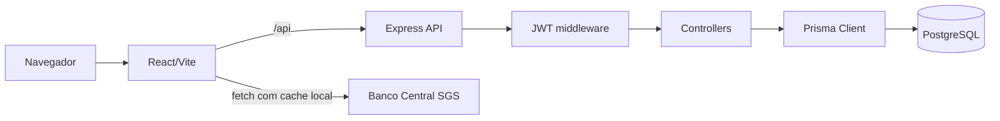

# Arquitetura

## Visão geral

Economic usa arquitetura web em duas camadas principais:

- frontend React/Vite para experiência do usuário;
- backend Express/Prisma para autenticação, persistência e API.

Em produção, o backend também serve o frontend compilado em `frontend/dist`, permitindo deploy em um único serviço Render.



## Estrutura de diretórios

```text
.
├── backend/
│   ├── prisma/
│   │   └── schema.prisma
│   ├── src/
│   │   ├── controllers/
│   │   ├── middlewares/
│   │   ├── routes/
│   │   ├── services/
│   │   └── index.js
│   ├── tests/
│   └── package.json
├── frontend/
│   ├── src/
│   │   ├── components/
│   │   ├── data/
│   │   ├── pages/
│   │   ├── routes/
│   │   ├── services/
│   │   ├── App.jsx
│   │   └── App.css
│   ├── index.html
│   └── package.json
├── docs/
├── interface/
├── usuarios/
├── main.py
├── render.yaml
└── package.json
```

## Frontend

Entrada:

- `frontend/src/main.jsx`

Roteamento:

- `frontend/src/App.jsx`

Principais páginas:

- `Inicio.jsx`
- `Analise.jsx`
- `Dados.jsx`
- `Financeiro.jsx`
- `Simulador.jsx`
- `Educacao.jsx`
- `Sobre.jsx`

Componentes principais:

- `Header.jsx`
- `Footer.jsx`
- `AuthPanel.jsx`
- `AuthModal.jsx`
- `AssistantWidget.jsx`
- `EconomicOrb.jsx`
- `SmartTaxSearch.jsx`
- `SiteComponents.jsx`

Serviços:

- `api.js`: instância Axios, base URL e injeção de token.
- `authService.js`: login, cadastro, perfil e histórico.
- `financeiroService.js`: transações, metas e investimentos.
- `systemService.js`: registro e leitura de interações.

Dados locais e externos:

- `dadosEconomicos.js`: base local, busca de produtos, cálculos estatísticos e chamadas ao SGS do Banco Central.

## Backend

Entrada:

- `backend/src/index.js`

Responsabilidades:

- configurar Express;
- aplicar Helmet, CORS, rate limit e JSON limit;
- registrar rotas;
- servir `frontend/dist` em produção;
- expor `/api/health`;
- garantir tabelas no banco em produção quando `DATABASE_URL` existir.

Rotas:

- `/api/auth`
- `/api/interactions`
- `/api/system`
- `/api/transacoes`
- `/api/metas`
- `/api/investimentos`

Middleware:

- `authMiddleware.js`: valida JWT Bearer e injeta `req.user`.

Serviços:

- `prismaClient.js`: singleton Prisma.
- `ensureDatabase.js`: criação defensiva de tabelas em ambientes onde migrations não rodam antes do start.

## Modelo de banco

Banco:

- PostgreSQL

ORM:

- Prisma

Modelos:

### User

Usuário autenticado.

Campos principais:

- `id`
- `nome`
- `email`
- `senha`
- `data_criacao`

Relacionamentos:

- `interactions`
- `transacoes`
- `metas`
- `investimentos`

### Interaction

Histórico de ações do usuário dentro do site.

Campos:

- `id`
- `userId`
- `tipo_acao`
- `descricao`
- `data`

### Transacao

Registro financeiro de receita ou despesa.

Campos:

- `id`
- `userId`
- `tipo`
- `categoria`
- `descricao`
- `valor`
- `data`

### Meta

Meta financeira com valor alvo e progresso.

Campos:

- `id`
- `userId`
- `nome`
- `valorAlvo`
- `valorAtual`
- `prazo`
- `criada_em`

### Investimento

Aplicação cadastrada pelo usuário.

Campos:

- `id`
- `userId`
- `nome`
- `tipo`
- `valor`
- `taxa`
- `data_inicio`

## Fluxo de autenticação

1. Usuário envia email e senha para `/api/auth/login`.
2. Backend valida credenciais com bcrypt.
3. Backend assina JWT com `JWT_SECRET`.
4. Frontend salva o token em `localStorage`.
5. Axios injeta `Authorization: Bearer <token>` nas próximas requisições.
6. `authMiddleware` valida token nas rotas protegidas.

## Modo demonstração

O modo demonstração é controlado no frontend por `localStorage.demoMode = "1"`.

Características:

- não usa token real;
- não grava transações, metas ou investimentos no banco;
- usa dados locais na sessão;
- permite avaliação rápida do produto.

## Pastas legadas

`interface/` e `usuarios/` contêm telas HTML/CSS/JS estáticas usadas como protótipo ou legado. A aplicação principal atual é a versão React em `frontend/` com backend Express em `backend/`.

Essas pastas não devem ser consideradas fonte principal de rotas de produção.
